# claude-obsidian-bridge

把 Claude Code 的 memory / rules / skills / plans / CLAUDE.md **白盒化**到你的 Obsidian vault, 让人类能 see / review / 共同维护 AI agent 的知识与决策.

> 底层 pattern 来自 [Karpathy 的 "LLM Wiki" gist](https://gist.github.com/karpathy/442a6bf555914893e9891c11519de94f) — LLM 增量维护一份结构化 markdown wiki, 人类 review 但不直接编辑. 本项目把它应用到一个特殊领域: **agent 自身的知识** (memory / rules / skills / CLAUDE.md). 完整映射见末尾 [与 Karpathy "LLM Wiki" 的关系](#与-karpathy-llm-wiki-的关系).

## 为什么

AI agent (Claude Code) 默认是**黑盒**:
- 每次 session 加载了什么? 不知道
- 制作 plan 时参考了哪些 memory/skill? 不可追溯
- 积累的 memory/rules 在哪里? 散在 `~/.claude/` 隐藏目录
- memory 怎么沉淀为 rules? 没有工具

接入 Obsidian 后:
- 所有知识资产在 vault 内, Obsidian backlink/tag/search/Bases 即开即用
- 每次 session 自动写"启动加载清单"到 vault
- 每个 plan 末尾自动追加"制作过程 trace" (Mermaid 时间轴 + 资源清单)
- 跨项目重复的 memory 一键扫描 + 半自动提级到 rules

## 安装

```
/plugin install Tianzhao0126/claude-obsidian-bridge
/obsidian-bridge-setup <vault-path> [<work-path>]
```

不传参数则交互式询问. 重启 Claude Code 后 hook 生效.

## 4 个核心能力

### 1. 知识资产 vault 透传 (维度 A)

`~/.claude/{rules,skills,CLAUDE.md}` 物理迁移到 vault, 原位置变 symlink. `~/.claude/projects/<encoded>/memory/` 同理. plans 反过来 — vault 内放反向 symlink 指向 `~/.claude/plans/`. **单向 symlink, 永远不双拷贝**.

### 2. 启动加载清单 (维度 B)

每个 session 启动后, vault 内自动写入 `Claude/_sessions/<date>_<id>.md`:
- 本次加载的 rules 列表 + 行数
- memory index 路径与 entries 数
- 可用 skills 数量
- hooks 注册情况

30 天自动清理.

### 3. Plan 决策追溯 (维度 C/D)

写 plan 时照常写. 退出会话后, plan 末尾自动追加:

````markdown
## 制作过程 (auto-generated)

**Skills 调用 (按时间):**
- 10:00:00 `superpowers:brainstorming`

**Memory 主动读取:**
- [[../memory/data-integrator/MEMORY|data-integrator/MEMORY]]

**Rules:** 全量 eager (Phase 4)

```mermaid
gantt
    dateFormat HH:mm:ss
    section Skills
    brainstorming :done, 10:00:00, 1s
```


````

Obsidian 里 mermaid 渲染为时间轴, wikilink 可跳转.

### 4. Memory → Rules 提级 (维度 E, 半自动)

```
/scan-memory-duplicates
```

输出候选表:

| File A | File B | 相似度 | 推荐目标 |
|---|---|---|---|
| `tscs/feedback_go_build` | `iam/feedback_go_lint` | 0.62 | rules/golang/coding-style.md |

选好对后:
```
/promote-memory <src> <dst-rules> --dry-run    # 先 dry-run 看 diff
/promote-memory <src> <dst-rules>              # 实际执行
```

工具只机械搬运 (改 rules + 删 memory + 改 MEMORY.md), **抽象表述由 Claude 在调用前完成**.

## 命令清单

| 命令 | 用途 |
|---|---|
| `/obsidian-bridge-setup` | 首次安装/重新配置, 指定 vault 与 work |
| `/obsidian-bridge-migrate` | 从手动安装的 auto-link.sh 迁移到 plugin |
| `/scan-memory-duplicates` | 扫所有 feedback/user 类型 memory 找跨项目重复 |
| `/promote-memory` | 把单条 memory 提级到指定 rules |

## 配置

`~/.claude/plugins/claude-obsidian-bridge/config.json` (由 setup 命令生成):

```json
{
  "vault_path": "/path/to/your/obsidian-vault",
  "vault_subdir": "Claude",
  "scan_paths_for_project_claudemd": ["/path/to/your/projects"],
  "trace_writeback": "inline",
  "session_log_enabled": true,
  "session_log_retention_days": 30,
  "memory_promote_dry_run_default": false
}
```

完整字段说明见 [docs/ARCHITECTURE.md](docs/ARCHITECTURE.md#configuration).

## 与 Karpathy "LLM Wiki" 的关系

本项目的底层 pattern 来自 [Karpathy 的 LLM Wiki gist](https://gist.github.com/karpathy/442a6bf555914893e9891c11519de94f). 在那个设想里:

- 用户提供 **raw sources** (论文 / 文章 / 笔记 / 会议纪要)
- LLM 增量维护一份**结构化 wiki** (markdown, Obsidian 渲染, 互联)
- 三层架构: **raw sources** → **wiki (LLM-owned)** → **schema** (CLAUDE.md / AGENTS.md)
- 三种操作: **ingest** 吸收新源, **query** 查并把答案回写, **lint** 健康检查
- 两份元文件: **index.md** (内容目录) + **log.md** (时间线)

**本项目把这套 pattern 应用到一个特殊领域 — agent 自身的知识**. 但 v1.0 只 cover 其中一部分, 下表带"对齐"列诚实标注:

| Karpathy 概念 | 本项目实例化 | 对齐 |
|---|---|---|
| wiki | `memory/` `rules/` `skills/` (agent 怎么工作 / 学到了什么 / 有什么能力) | ✅ |
| index.md | `memory/<friendly>/MEMORY.md` 格式匹配, 由 Claude 全局 prompt 维护 (非本插件) | ✅ delegated |
| schema | `CLAUDE.md` 是 agent 行为约束, 不是专门的 "如何维护 wiki" protocol | ⚠️ 概念漂移 |
| raw sources | 仅持久化 tool calls 子集 (`.tool-trace.jsonl`); 对话本体不存 | ⚠️ 仅 tool calls |
| ingest | 维度 A 只把已有 memory symlink 透出 — 是 file plumbing, **不是** Karpathy 意义的"读源 → 抽取 → 整合到 entity 页" | ⚠️ 仅 bootstrap |
| log.md | 维度 B + C + D 是三种不同形态 (`_sessions/` 一文件一 session + plan 内嵌 trace + `.tool-trace.jsonl`), **不是** 单一 append-only md log | ⚠️ 形态不一致 |
| lint | 维度 E 仅做跨项目"重复检测", 不 cover 矛盾页 / orphan / stale claim / 缺失 cross-ref | ⚠️ 严格子集 |
| query | 无 plugin 实现 (Claude 用 Read/Grep 直接查, query 结果不自动回写 wiki) | — gap |

**为什么值得单拿出来**: Karpathy gist 里默认的 wiki 通常是**用户领域**的 (你读的书, 你跟的研究, 你公司的内部资料). Agent 自身知识是一个 meta 维度 — 它决定 agent **怎么处理**那些用户领域 wiki. 两类 wiki 都需要 "LLM 维护 / 人类 review" 这同一份契约, 但服务于不同目标, 应该并行存在.

**互补不替代**: 同一个 Obsidian vault 完全可以同时跑两套 — Karpathy 风格的领域 wiki (`<vault>/research/`, `<vault>/books/`) + 本项目的 agent wiki (`<vault>/Claude/`). 它们共享同一个 Obsidian 渲染与导航, 但 schema / lifecycle 各自独立.

### Gap 与 roadmap (诚实清单)

照搬 Karpathy pattern 的几处至今**未实现**, 标在这里避免读者误以为 reframing = implement 完成:

- **真正的 `log.md`** — `_sessions/<date>_<id>.md` 是一文件一 session, 没有跨 session 单一时间线. Karpathy 那种 `grep "^## \[" log.md | tail -5` 看最近 entries 的能力本项目不具备.
- **完整 lint pass** — `/scan-memory-duplicates` 只覆盖"重复检测". 没做: 矛盾页对检测、stale claim、orphan 页、缺失 cross-ref、data gap 建议.
- **真正的 ingest 流水** — 加新 memory 完全靠 Claude 在 session 中 Write, plugin 不参与"读源 → 抽取实体 → 更新 entity / concept / cross-ref"这套. 维度 A 只是 file plumbing.
- **schema 文档** — vault 内缺一份描述"agent wiki 该怎么组织 / page format / ingest 工作流"的协议. memory format 由 Claude 系统级全局 prompt 隐式定义, vault 内不显式.
- **query 操作** — 无 plugin 提供的查询入口或答案回写工具. Karpathy 强调"好的 query 答案应该 file 回 wiki 成新 page", 本项目无此入口.

v2 优先级建议: 单一 log.md 汇总 + lint 扩展 (至少"orphan + missing cross-ref") + vault 内 schema 文档.

## 设计原则

**单一真相源 + 单向 symlink, 永远不双拷贝.** 详情 [docs/ARCHITECTURE.md](docs/ARCHITECTURE.md).

## 平台

v1.0 仅 macOS 测试通过. Linux 适配在 v1.1 (`date` / `find` / `stat` 等 GNU vs BSD 差异).

## License

MIT
