# 示例: Plan 末尾的 trace 写回

下面是一个真实 plan 退出会话后 `claude-obsidian-bridge` 自动追加的 `## 制作过程` 小节示例.

---

# 示例 Plan: 添加用户头像上传 (虚构内容)

## Context

用户在 profile 页加头像上传功能.

## Approach

1. 后端 `/api/avatar/upload` 接收 multipart, 存 S3
2. 前端 ProfilePage 加 file input + 上传按钮
3. 完成后刷新头像 URL

## Critical Files

- `server/handlers/avatar.go`
- `web/src/pages/Profile.tsx`

## Verification

- 上传 jpg/png 都成功
- 上传 > 5MB 应被拒绝
- 上传非图片应被拒绝

---

## 制作过程 (auto-generated)

> 由 claude-obsidian-bridge 在 session 结束时自动追加. 反映本 plan 形成时实际加载/调用的资源.

**Skills 调用 (按时间):**
- 10:00:00 `superpowers:brainstorming`
- 10:15:00 `frontend-design`
- 10:42:00 `superpowers:writing-plans`

**Memory 主动读取:**
- [[../memory/data-integrator/architecture_overview|data-integrator/architecture_overview]]
- [[../memory/tscs/project_architecture|tscs/project_architecture]]

**Skills 全文加载:**
- [[../skills/use-modern-go/SKILL|use-modern-go/SKILL]]

**Plans 引用:** (无)

**Rules:** 全量 eager (Phase 4), 见 [[../docs/session-loading-flow]]

```mermaid
gantt
    dateFormat HH:mm:ss
    title plan 制作时间轴
    section Skills
    superpowers_brainstorming :done, 10:00:00, 1s
    frontend-design :done, 10:15:00, 1s
    superpowers_writing-plans :done, 10:42:00, 1s
```



---

## 解读

- **Skills 调用**: 看出 Claude 走的是 brainstorming → frontend-design → writing-plans 这条路径. 如果你 review 这个 plan 觉得"不够考虑后端", 看 Skills 列表就能确认 — 没调 backend 相关 skill, 可能漏看了
- **Memory 读取**: data-integrator 和 tscs 两个项目的 architecture overview 都被 Claude 主动读取, 暗示参考了这两个项目的现有设计
- **mermaid 时间轴**: 直观看出 Claude 各阶段花费的时间. 如果 brainstorming 太短 (没充分对齐) 或太长 (反复绕圈), 可以从时间轴看出来
- **Rules**: 全量 eager 加载意味着 Claude 始终在 `behavior.md` 等约束下工作

## 何时不会写回

- 配置 `trace_writeback: "off"` 时
- 当前 session 没 Write 任何 `/plans/` 路径
- plan 已含 `## 制作过程` 章节 (幂等保护)
- session 异常退出 (Ctrl-C 等) Stop hook 未触发 — 此时手动:

```bash
$CLAUDE_PLUGIN_ROOT/hooks/finalize-plan.sh <<< '{"session_id":"<your-session-id>"}'
```

## 如何关闭/切换为 sidecar

编辑 `~/.claude/plugins/claude-obsidian-bridge/config.json`:

```json
{
  "trace_writeback": "sidecar"  // 写到 <plan>.trace.md 单独文件
}
```

或:

```json
{
  "trace_writeback": "off"  // 完全关闭
}
```
